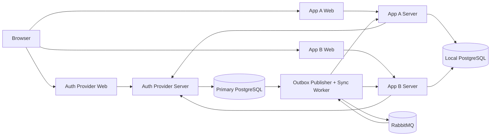

# Distributed SSO and Logout Synchronization

Implementasi Tugas Seleksi 2 Laboratorium Pemrograman 2026: Auth Provider,
dua relying application, dua PostgreSQL database, serta pipeline transactional
outbox berbasis RabbitMQ untuk sinkronisasi pencabutan sesi.

## Identitas

- Nama: Yusuf Faishal Listyardi
- NIM: 13524014

## Checklist kelengkapan fitur

### Program utama

- [x] F00 - Arsitektur dan Komponen
- [x] F01 - Konfigurasi Dasar dan Infrastruktur
- [x] F02 - Auth Provider Platform: Central Session Server dan Control Panel
- [x] F04 - Relying Applications: App A dan App B
- [x] F05 - Auth Provider Platform: Event Processing

### Bonus

- [ ] B01 - MFA atau WebAuthn
- [ ] B02 - Observability
- [x] B03 - Liveness dan Readiness Probe
- [ ] B04 - Graceful Shutdown

## Arsitektur



Central session dan credential hanya dimiliki Auth Provider. Relying app hanya
menyimpan hash local-session token, `externalUserId`, `centralSessionId`, serta
cache profil. Authorization code dan access token disimpan sebagai hash; nilai
mentahnya tidak disimpan di database. Opaque token dipilih agar pencabutan dan
validasi tetap terpusat, dengan trade-off bahwa endpoint `userinfo` memerlukan
akses ke Auth Provider.

Event domain dan `EventDelivery` dibuat dalam transaksi yang sama dengan
pencabutan. Publisher membaca event `pending`, mengirim pesan persistent, lalu
menandainya `published` setelah broker confirmation. Worker mengirim internal
logout dengan shared secret, menyimpan hasil delivery per aplikasi, dan
memindahkan pesan ke retry queue atau DLQ sesuai hasil. Status/revoke digunakan
sebagai soft deletion agar histori operasional tetap dapat diaudit.

RabbitMQ dipilih karena mendukung durable queue, publisher confirmation,
acknowledgement, serta topologi retry/DLQ secara langsung; konsekuensinya sistem
memerlukan broker dan worker tambahan. Panggilan `POST /internal/logout`
diautentikasi menggunakan shared secret khusus service-to-service pada header
`x-internal-secret`; nilainya hanya berasal dari environment dan dibandingkan
secara timing-safe. Untuk produksi lintas host, kanal ini tetap perlu dilindungi
TLS dan secret perlu dirotasi berkala.

## Stack

| Teknologi | Versi yang digunakan |
| --- | --- |
| Node.js | 22 (`node:22-bookworm-slim`) |
| TypeScript | 5.5 |
| Express | 5.1 |
| React | 18.3 |
| Vite | 6.4.3 |
| Tailwind CSS | 3.4 |
| Prisma ORM/CLI | 6.19.3 |
| PostgreSQL | 16 Alpine |
| RabbitMQ | 3 Management Alpine |
| amqplib | 0.10.8 |
| Vitest | 4.1.10 |
| Docker Compose | Compose Specification |

## Menjalankan aplikasi

Prasyarat: Docker Desktop dengan Docker Compose.

1. Salin `.env.example` menjadi `.env`.
2. Ganti seluruh nilai `replace-with-...`. Samakan password pada
   `AUTH_DATABASE_URL`/`LOCAL_DATABASE_URL` dengan `POSTGRES_PASSWORD`.
3. Jalankan:

```powershell
docker compose up --build
```

Auth server otomatis menjalankan seluruh migration Auth DB dan Local DB lalu
melakukan idempotent seed. Tidak diperlukan setup database manual.

| Komponen | URL |
| --- | --- |
| Auth Provider Web / Control Panel | http://localhost:4000 |
| Auth Provider API | http://localhost:4001 |
| App A | http://localhost:4100 |
| App A API | http://localhost:4101 |
| App B | http://localhost:4200 |
| App B API | http://localhost:4201 |
| RabbitMQ Management | http://localhost:15672 |

Seed membuat `admin@example.com` dan `student@example.com`. Keduanya memakai
password dari `SEED_DEFAULT_PASSWORD`; password tidak ditanam di source code.
Admin menjadi anggota group `administrators`, sedangkan student memperoleh
akses awal ke App A dan App B.

Untuk menjalankan migration/seed dari host setelah `.env` tersedia:

```powershell
npm.cmd run db:generate
npm.cmd run db:migrate
npm.cmd run db:seed
```

## Konfigurasi

Seluruh credential berasal dari environment variable. Daftar lengkap dan nilai
contoh tersedia di [.env.example](./.env.example), termasuk URL database,
RabbitMQ, cookie/internal secrets, TTL session, nama queue, jumlah retry,
retry delay, dan interval polling outbox. Aplikasi gagal cepat bila credential
wajib tidak tersedia.

## Alur SSO

1. Relying app membuat `state` dan PKCE verifier dalam cookie HttpOnly yang
   namanya diisolasi per aplikasi, lalu mengarahkan browser ke `/oauth/authorize`.
2. Auth Provider memvalidasi central session, user aktif, aplikasi aktif,
   redirect URI, serta allow policy group.
3. Auth Provider menerbitkan authorization code singkat dan sekali pakai.
4. Relying app menukar code dengan PKCE verifier. Penukaran code, pembuatan
   token, dan audit terjadi atomik.
5. Relying app mengambil `userinfo`, menyimpan profile cache, lalu membuat local
   session secara transaksional.

## Alur dan pengujian kegagalan logout

1. Login ke App A dan App B menggunakan `student@example.com`.
2. Buka halaman Auth Provider lalu pilih **SSO logout**. Kedua local session
   akhirnya berstatus `revoked` setelah event diproses worker. Tombol logout
   pada App A/App B hanya melakukan local logout sesuai spesifikasi.
3. Untuk menguji retry, hentikan salah satu server aplikasi, lakukan SSO logout,
   lalu nyalakan kembali server tersebut sebelum batas percobaan tercapai.
   Delivery aplikasi sehat tetap `succeeded`; aplikasi yang gagal menjadi
   `retrying` dan pulih secara independen.
4. Biarkan aplikasi gagal sampai batas percobaan untuk melihat delivery
   `failed` dan event `dead_lettered`; pesan tersedia di
   `sso.revocations.dlq` pada RabbitMQ Management.
5. Replay event yang sama aman: consumer mengembalikan `alreadyProcessed` dan
   tidak melakukan pencabutan kedua kali.

## Endpoint penting

| Komponen | Method dan path | Fungsi |
| --- | --- | --- |
| Auth | `GET /health`, `GET /health/live` | Liveness Auth Server tanpa memeriksa dependency |
| Auth | `GET /health/ready` | Readiness Primary DB dan RabbitMQ (`503` bila salah satu gagal) |
| Auth | `POST /auth/login`, `POST /auth/logout` | Central login dan SSO logout |
| OAuth | `GET /oauth/authorize` | Validasi client, redirect URI, session, dan policy; terbitkan code |
| OAuth | `POST /oauth/token` | Tukar code sekali pakai menjadi opaque access token |
| OAuth | `GET /oauth/userinfo` | Ambil profil berdasarkan bearer token |
| Admin | `GET /admin/session` | Validasi sesi administrator |
| Admin | `GET/POST /admin/users`, `PATCH /admin/users/:id` | Lihat, buat, ubah, aktifkan/nonaktifkan user |
| Admin | `GET/POST /admin/groups`, `PATCH /admin/groups/:id` | Lihat, buat, dan ubah group |
| Admin | `POST /admin/groups/:id/users`, `DELETE /admin/groups/:groupId/users/:userId` | Tambah/hapus membership |
| Admin | `GET /admin/memberships` | Lihat seluruh membership |
| Admin | `GET/POST /admin/applications`, `PATCH /admin/applications/:id` | Kelola konfigurasi dan status aplikasi |
| Admin | `POST /admin/applications/:id/policies`, `DELETE /admin/applications/:applicationId/policies/:groupId` | Tambah/hapus allow policy |
| Admin | `GET /admin/policies`, `GET /admin/audit-logs`, `GET /admin/events` | Monitoring policy, audit, dan delivery event |
| App A/B | `GET /health`, `POST /login/start`, `GET /auth/callback` | Health dan alur authorization code |
| App A/B | `GET /session`, `POST /logout` | Status dan local logout |
| App A/B | `GET /activity-logs`, `GET /processed-events` | Data operasional UI |
| App A/B | `POST /internal/logout` | Back-channel revocation dari worker |

Semua error API memakai envelope `{ error: { code, message, requestId } }`.

## Verifikasi

```powershell
npm.cmd test
npm.cmd run build
docker compose --env-file .env config --quiet
```

Pengujian mencakup policy, code reuse/concurrency, rollback transaksi,
PasswordChanged, deactivation, AccessPolicyChanged, idempotency per aplikasi,
retry/DLQ, isolasi local logout, status expired/revoked, dan route authorization.

## Bonus B03 - Liveness dan Readiness Probe

- `GET /health/live` mengembalikan `200` selama proses Auth Server masih dapat
  merespons dan tidak memeriksa dependency.
- `GET /health/ready` menjalankan query ringan ke Primary DB dan membuka koneksi
  AMQP ke RabbitMQ. Semua pemeriksaan berjalan paralel dengan batas waktu dari
  `HEALTH_READINESS_TIMEOUT_MS`.
- Readiness mengembalikan `503` dan status komponen `down` ketika dependency
  gagal, tanpa membocorkan alamat internal, credential, atau pesan error mentah.
- Endpoint `/health` lama tetap tersedia sebagai alias liveness untuk menjaga
  kompatibilitas. Health check Docker menggunakan endpoint readiness.

Untuk demonstrasi, bandingkan `/health/live` dan `/health/ready`, hentikan
sementara `auth-db` atau `rabbitmq`, lalu nyalakan kembali. Liveness harus tetap
`200`, readiness berubah menjadi `503`, dan kembali `200` tanpa me-restart Auth
Server setelah dependency pulih.

## Screenshot

### Auth Provider Control Panel


### App A dashboard


